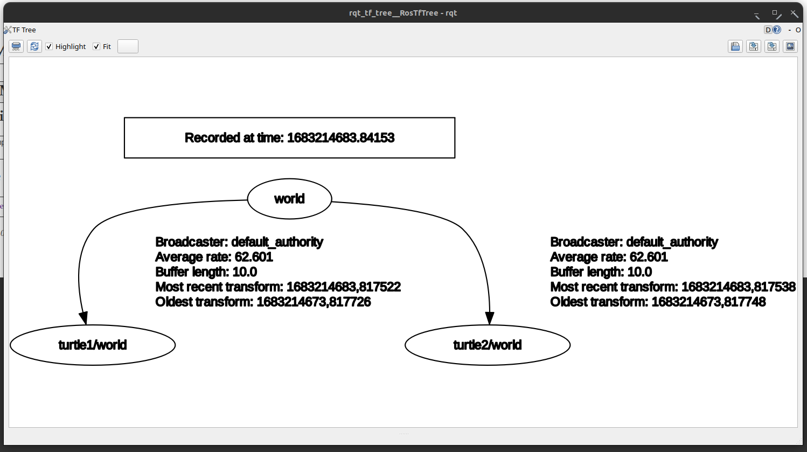

# multi_robot_tf_relay
Multi Robot Tf Relay on ROS2 using Python

The package's purpose is to forward every Tf messages from `<namespaces>/tf` to `/tf` topic with corresponding prefix namespaces on every frame.
Multi robotic system could sometimes be a bit tricky to handle, especially with tf and frame prefix. One way would be to manually add tf prefix on every frame while creating your tf tree on each robot. Even if this solution could be automated, in some specific cases it is useless (such as when you do not have the hand on the tf tree creation). Plus in ROS2 the legit way to deal with multi robot would be to add namespace to every topic (including tf) without adding additional frame prefix and then run this package to merge everything into one single tf topic with all the corresponding frame prefix.




## Compilation
Add this package into the `/src` folder of your ROS2 workspace.

Then inside a sourced terminal and at the root of your workspace (not inside the `/src` directory) run:
```shell
$ colcon build --packages-select multi_robot_tf_relay
```

## Launch the package

To launch the package (after compilation) you first need to source ROS2 and your workspace:

To source the workspace:
```shell
$ source install/setup.bash
```
or
```shell
$ source install/local_setup.bash
```

And then launch the package:
```shell
$ ros2 launch multi_robot_tf_relay broadcaster_node.launch.py
```